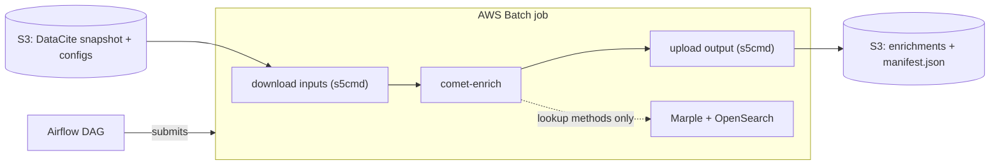
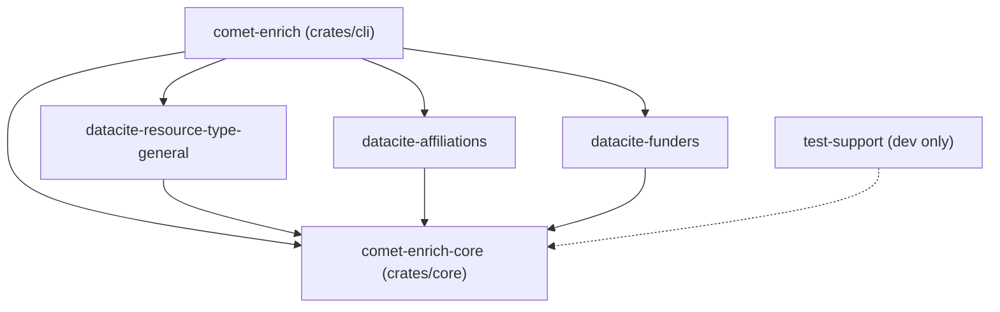
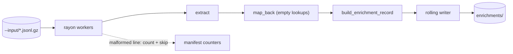
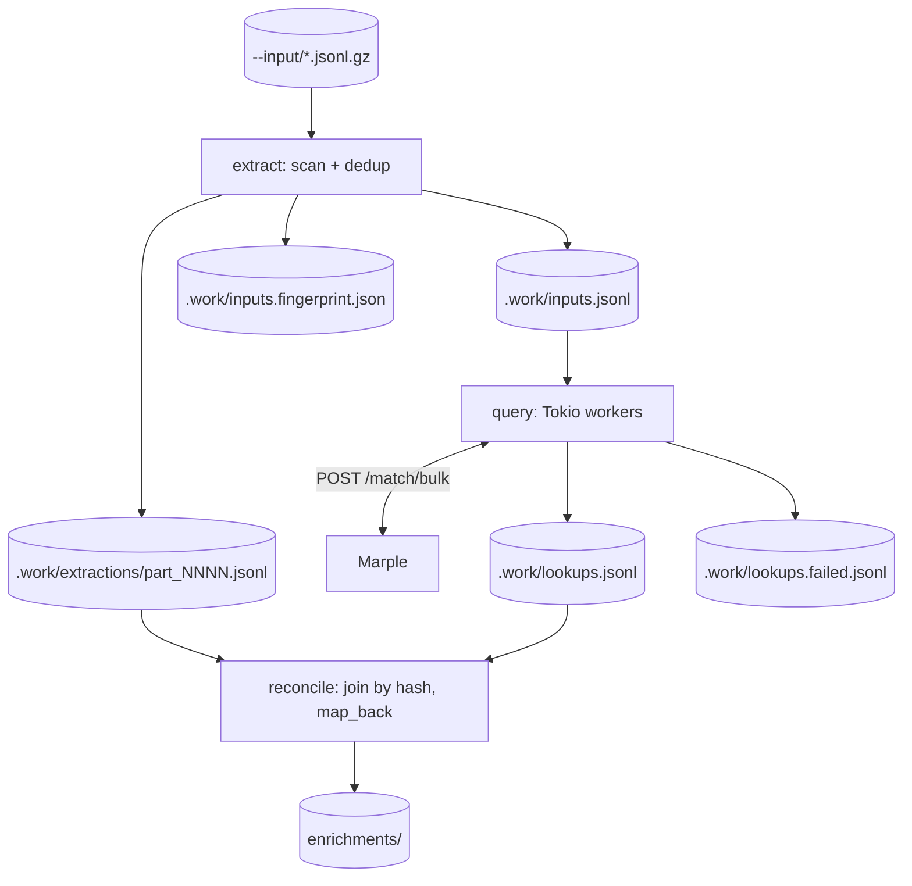
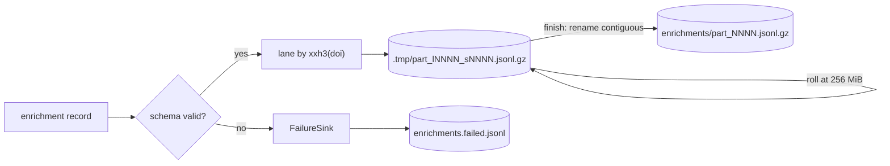

# Architecture

`comet-enrich` generates DataCite enrichment records from the
[DataCite Public Data File](https://datafiles.datacite.org/). It is a Rust workspace with one
binary. The binary reads a directory of DataCite `*.jsonl.gz` files, runs one enrichment method,
and writes records that match the DataCite enrichment input schema
(`configs/schema/enrichment_input_schema.json`). ROR matching uses
[Marple](https://gitlab.com/jdiprose/marple), on the `feature/marple-speed-improvements` branch.

In the COMET pipeline, Airflow and AWS Batch decide when jobs run, where the input data lives, and
where the output is uploaded. `comet-enrich` just works inside the local output directory it is
given: it reads the downloaded input, writes enrichment parts, writes a manifest, and keeps any
lookup work files under `.work/`.



Each command runs one method. `resource-type-general` reclassifies
`types.resourceTypeGeneral` from the free-text `types.resourceType` value. `affiliations` matches
creator and contributor affiliation strings to ROR IDs. `funders` matches funder names to ROR IDs.
See [usage.md](usage.md) for the command line.

## Workspace layout

| Crate                                   | Purpose                                                                        |
|-----------------------------------------|--------------------------------------------------------------------------------|
| `crates/cli`                            | The `comet-enrich` binary: one subcommand per method, plus completions         |
| `crates/core`                           | Shared runners, writer, validation, provenance, manifests, dedup, match client |
| `crates/datacite-resource-type-general` | Transform method: reclassify free-text resource types                          |
| `crates/datacite-affiliations`          | Lookup method: affiliation strings to ROR IDs                                  |
| `crates/datacite-funders`               | Lookup method: funder names to ROR IDs                                         |
| `crates/test-support`                   | Test fixtures and assertions shared across crates                              |

The method crates hold the parsing and mapping rules that are specific to each enrichment. Core
handles the work that is the same for every method: reading input files, deduplicating lookup
inputs, running staged lookups, adding provenance, validating records, writing output, and writing
the manifest. A new method should usually be a new crate, not a change to the core runner.



## The method interface

Every method implements `EnrichmentMethod` in `crates/core/src/method.rs`. The trait has two
associated types and three methods:

- `Extraction` is the typed value carried from parsing to `map_back`.
- `Lookup` is the result stored for one unique lookup input. Transform methods use `()`.
- `extract` reads one DataCite record and returns either extracted values or a skip reason.
- `inputs` returns the lookup strings for one extraction. The default is an empty list.
- `map_back` combines an extraction with any lookup results and returns enrichment value changes.

Skip reasons are counted in the manifest, so records that are out of scope are visible in the run
summary. Lookup methods use `inputs` during extract, and then derive the same hash in `map_back` to
find the match result. Transform methods leave `inputs` alone.

An enrichment change contains an action (`update`, `updateChild`, `insert`, or `deleteChild`), the
DataCite field to update, and the original and enriched values. The field is set on each output
record; this matters for `affiliations`, which can update either `creators` or `contributors`.

Methods return only the value part of the enrichment. Core adds provenance, validates the complete
record, and writes it.

## Transform path

`resource-type-general` uses the single-pass transform runner (`crates/core/src/transform.rs`).
The runner finds every `*.jsonl.gz` file under `--input`, scans them in parallel with rayon, calls
the method for each DataCite record, and sends the resulting enrichment records to the rolling
writer. There is no lookup step, so this path does not write staged lookup files under `.work/`.



Malformed JSON lines are counted and skipped. If a whole file cannot be read, that file is counted
as failed and the rest of the run continues. Records already written from other files are not
removed; the manifest marks the run `partial`.

## Staged lookup path

`affiliations` and `funders` use the staged lookup runner (`crates/core/src/staged_run/`). The
runner writes its work files under `<output>/.work/` and runs three stages:

1. `extract` scans the input files, writes one extraction row per in-scope unit to
   `extractions/part_NNNN.jsonl`, and writes unique lookup inputs to `inputs.jsonl`, keyed by
   xxh3 hash. The same affiliation and funder strings appear many times in DataCite, so Marple
   only needs to see each unique string once.
2. `query` reads `inputs.jsonl` and sends the inputs to Marple with concurrent Tokio workers.
   Matches are written to `lookups.jsonl`; failed or unmatched inputs are written to
   `lookups.failed.jsonl`.
3. `reconcile` reads the extractions and lookups, joins them by hash, calls `map_back`, and writes
   enrichment records through the same writer as the transform path.



### Resume and safety

Each completed stage writes a marker: `extract.done`, `query.done`, or `reconcile.done`. A later
run in the same output directory starts at the first missing marker. If a stage needs to run, it is
rerun from the beginning. There is no checkpoint inside a stage, which avoids treating half-written
query output as complete.

Two checks keep the extraction and lookup files in sync:

- The hash width, 64 or 128 bits, is fixed for the run and saved in `.work/hash.bits`. A resume
  with a different hash width is rejected because the hashes would not join.
- The input files are fingerprinted after extract in `.work/inputs.fingerprint.json`. Each entry
  records the relative path, compressed size, and gzip trailer CRC32. A normal resume stops if the
  input files have changed.

`--from-scratch` clears the work directory and starts again. A single stage can also be rerun, for
example `comet-enrich affiliations --stage query`, but only if the previous stage files already exist.

### Match service client

The match client (`crates/core/src/match_service.rs`) posts batches to Marple's `/match/bulk`
endpoint, using either the `affiliation` or `funder` task. It expects one result slot per input, in
the same order as the request. Each slot is a match, a clean no-match, or an item-level error from
Marple. It retries 429, 408, and server errors with capped backoff, and it honours a numeric
`Retry-After` header up to 120 seconds. HTTP 413 is not retried; the fix is to lower
`--ror-batch-size`.

`lookups.failed.jsonl` records whether an input had `no_match` or an `error`. Timeouts and errors
are counted as lost lookups in the manifest, so the run is marked `partial`. A clean `no_match` is
still useful information, but it does not mean the service failed.

Tests use the in-memory `FakeMatchService` for staged runs. The real Marple client has HTTP tests
with a mock server.

## Output contract

`--output` is a directory. A completed run writes:

```text
<output>/
  enrichments/
    part_0000.jsonl.gz
    part_0001.jsonl.gz
  enrichments.failed.jsonl
  manifest.json
  .work/
```

`enrichments/` contains gzip-compressed JSONL parts. The part files are just chunks; consumers
should read every `*.jsonl.gz` file in the directory.

The writer (`crates/core/src/writer.rs`) routes records to writer lanes by hashing the DOI
(`xxh3(doi) % lanes`). The default is one lane. Each lane starts a new gzip part when the current
part reaches 256 MiB compressed. Parts are first written under `enrichments/.tmp/` and renamed to
`part_NNNN.jsonl.gz` only after the run finishes.

Records are validated against the enrichment input schema just before they are written, unless
`--no-validate` is used. Invalid records are written to `enrichments.failed.jsonl` with the
validator errors, and the run continues as `partial`. The failures file is created only if there is
at least one failed record.



`.work/` is only needed for staged lookup runs and local resume. The Batch upload can exclude it.

## Provenance

Each method has a provenance YAML file under `configs/provenance/`. The file is loaded before the
run starts. Unknown fields are rejected, and controlled-vocabulary values are checked against the
DataCite lists and required COMET entries. That means a bad provenance file fails before the run
starts instead of being copied into every output record.

The validated provenance template is rendered once and then copied into each enrichment record by
`build_enrichment_record`. Method code does not build provenance blocks itself.

## Manifest and status

Every completed full run writes `manifest.json` at the output root, with `schema_version` 1. The
manifest records:

- method name and version;
- source release dates supplied on the command line;
- output paths;
- counters for files, records, malformed lines, emitted records, schema failures, and skipped
  reasons;
- coverage and validation counts;
- the dedup hash and lookup match summary for staged methods;
- stage timings;
- `success` or `partial` status.

The transform runner builds the manifest from its run stats. The staged runner builds it from the
stage stats, and only after all three stages are complete.

| Condition                                       | Status    |
|-------------------------------------------------|-----------|
| Complete pass, no data loss                     | `success` |
| At least one input file failed                  | `partial` |
| At least one record failed schema validation    | `partial` |
| At least one lookup input lost to timeout/error | `partial` |
| Staged pipeline incomplete                      | `partial` |

The run summary is embedded in the manifest instead of being written as a separate report file.

## Methods

### resource-type-general

A transform method. It matches the free-text `types.resourceType` against reference values from
`configs/reclassification_rules.yaml`. The matcher tries normalized exact matches, whitespace
concatenation, camelCase splitting, and then Levenshtein distance under the configured threshold.
Typo corrections are applied first, and redundant values are ignored. A changed classification
emits an `update` on `types`; records outside the configured scope are counted as skipped. See
[commands/resource-type-general.md](commands/resource-type-general.md).

### affiliations

A lookup method. It extracts one unit per creator or contributor that has affiliations, looks up
each affiliation string with Marple's `affiliation` task, and emits an `updateChild` enrichment
only when that person gains a new ROR match. Valid existing ROR IDs are left alone; invalid ones
can be replaced by a name match. The output field is set per record because the method can update
both `creators` and `contributors`. See
[commands/affiliations.md](commands/affiliations.md).

### funders

A lookup method. It extracts one unit per funding reference with a funder name and normalizes
existing ROR and Crossref Funder identifiers. The ROR registry file is loaded at startup to build
the Crossref Funder ID to ROR crosswalk. References with a valid ROR ID, or a Crossref Funder ID in
the crosswalk, are skipped. Invalid ROR IDs remain eligible for replacement by a name match.
Unresolved names are looked up with Marple's `funder` task; a match emits an `updateChild` adding
the funder's ROR identifier. See
[commands/funders.md](commands/funders.md).

## Operational context

The COMET Airflow DAGs decide when enrichment jobs run and where their outputs are stored. The
transform method runs in the generic `enrich` Batch job. The lookup methods run in the
`enrich-with-ror` multi-container job, which starts OpenSearch and Marple alongside the enrichment
container. See the
[COMET data infrastructure architecture](https://github.com/cometadata/comet-data-infrastructure/blob/main/docs/architecture.md)
for the Batch setup.

`comet-enrich` does not start Marple or seed the OpenSearch index. The lookup methods expect a
running service at `--ror-service-url`. In COMET runs, this is the
[`feature/marple-speed-improvements`](https://gitlab.com/jdiprose/marple/-/tree/feature/marple-speed-improvements)
branch of `https://gitlab.com/jdiprose/marple.git`. Funders also needs the ROR registry JSON file
so it can skip references already identified by Crossref Funder ID.

## Extending

A new method is usually a new crate that implements `EnrichmentMethod`. A transform method uses the
single-pass runner with `Lookup = ()`. A lookup method uses the staged runner, returns stable
lookup input strings from `inputs`, and stores enough data in each extraction to build the final
DataCite value in `map_back`.

Tests should cover parser edge cases, `map_back`, and at least one end-to-end run. Lookup methods
should use the in-memory fake match service for pipeline tests and keep HTTP mock tests for the
real Marple client. See [conventions.md](conventions.md) for project conventions.
